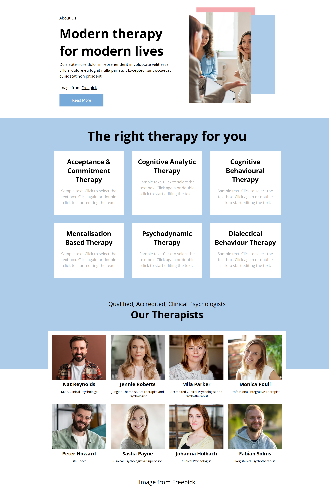

# Modern Therapy 🌿



Modern Therapy is a **responsive website** built using **HTML** and **CSS**, focusing on clean code, elegant layout, and user-friendly design. The site is perfect for showcasing a modern online therapy or wellness service.

---

## 🔗 Live Demo

👉 [Live Demo](https://stepanyan-levon.github.io/Modern-therapy/)

---

## 🛠️ Built With

- **HTML5**
- **CSS3**
- **Responsive Design**
- **Flexbox & Media Queries**

---

## 📁 Project Features

- ✅ Fully responsive layout (desktop, tablet, mobile)
- ✅ Modern and minimal design
- ✅ Clean, well-structured code
- ✅ Easy to customize and extend

---

## 🚀 Getting Started

To run this project locally:

1. Clone the repository:
   ```bash
   git clone https://github.com/Stepanyan-Levon/Modern-therapy.git
